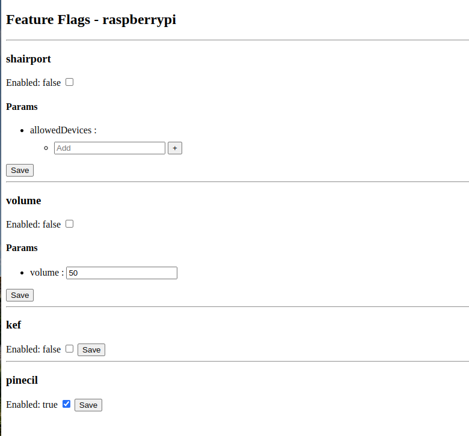
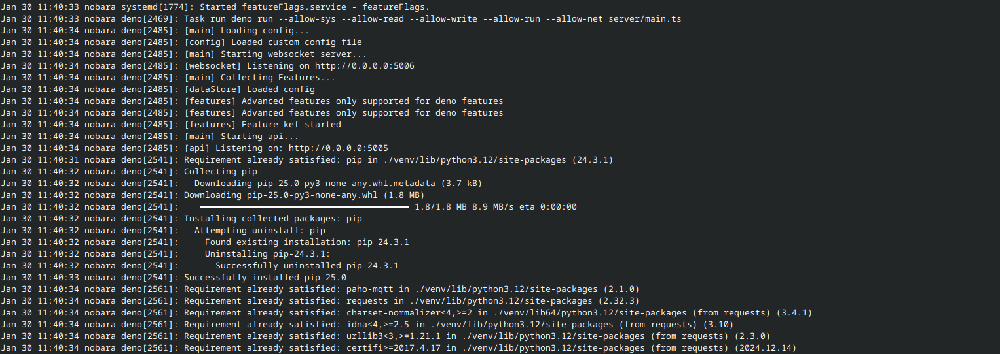

# featureFlags

Run scripts and programs on any device and control and configure them using a browser.

Available features:

- "Shairport": Restrict access to a shairport instance using mac filters
- "Volume": Control speaker volume remotely
- "Pinecil": Broadcast the state of your Pinecil via MQTT
- "Kef": Turn on your speakers automatically when audio playback starts

Webinterface:



Log output:



## Setup

1. Clone this repo:
2. Allow non root programs to bind on port 80 (or change the port of the webinterface):

```bash
sudo setcap CAP_NET_BIND_SERVICE=+eip ~/.deno/bin/deno
```

3. [Configure featureFlags](#configuration)
4. Create a system service:

```bash
nano $HOME/.config/systemd/user/featureFlags.service
```

```bash
[Unit]  
Description=featureFlags
After=network.target  
StartLimitIntervalSec=0  
  
[Service]  
Type=simple  
Restart=always  
RestartSec=3  
WorkingDirectory=/home/pi/featureFlags
ExecStart=/home/pi/.deno/bin/deno task run 
  
[Install]  
WantedBy=default.target
```

5. Start service

```bash
systemctl --user daemon-reload
systemctl --user enable featureFlags --now
systemctl --user status featureFlags

# View logs
journalctl --user -u featureFlags -e -f
```

## Configuration

Copy the default configuration file at `configs/server.default.json` to `configs/server.json` to edit!
Use a editor like VSCode to get Autocomplete and linting.

To execute features you need to specify the location of their executable:

- Run `which ${executable}` to get executable location, example: `which deno` -> `/home/pi/.deno/bin/deno`
- Put the output under a new nickname in the `executables` object

Explanation:

```json
{
    "$schema": "./server.schema.json",
    "executables": {
        // Key-Value pair of executable nicknames -> executable locations
        "deno": "/home/pi/.deno/bin/deno",
        "python": "/usr/bin/python"
    },
    "port": 80 // Port for webinterface
}
```

## Creating features

1. Copy your script/program under a new folder in `features/`
2. Create a `feature.json` config file (use a editor like VSCode for autocomplete):

```json
{
    "$schema": "../utils/feature.schema.json",
    "type": "process", // Currently the only supported value
    "executable": "python", // Nickname of the executable from the configuration 
    "websocket": false, // Advanced feature for deno scripts, take a look at shairport for an example
    "args": [
        "installer.py" // Arguments used for stating the feature
    ],
    "expose": {
        "inline": [
            // Inline arguments will be appended to the start arguments
            {
                "name": "allowedDevices", // Used for frontend
                "param": "--allowed-clients", // Name of parameter
                "type": "array", // Allowed types: string, array, boolean
                "description": "Comma seperated list of macs for allowed devices",
                "default": [] // Default value
            }
        ]
    },
    "report": [] // Currently unused
}

```

## Development

Made with alpine.js and deno.

Start the backend server with:

```bash
deno run --allow-read --allow-write --allow-run --allow-net server/main.ts
```
